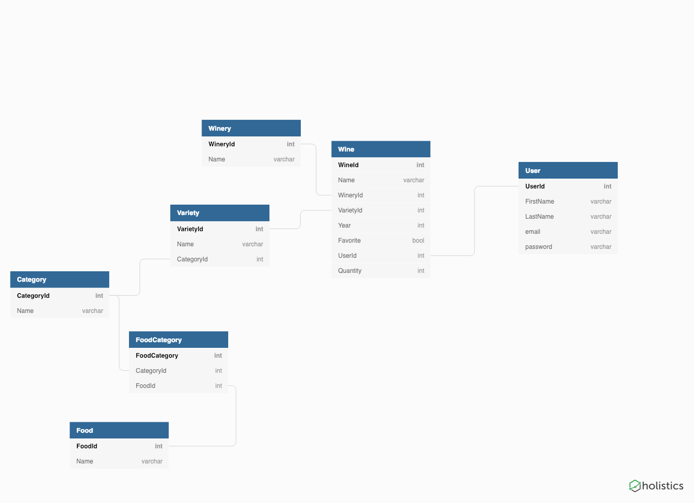

# Welcome to Sommelier

## What is Sommelier?

Sommelier's job is to help people with large wine collections keep track of their inventory, while also making wine and food pairing recommendations. Users enter the wines they have, and once a user has built his/her "cellar" inside the application, the user will select what he/she is having for dinner that evening. The application will look at all of the wines the user has and make recommendations. This application was made using C#, ASP.NET MVC, Entity Framework, Identity Framework, and Materialize css.

## Languages and Technologies
* C#
* ASP.NET MVC
* Entity Framework
* Identity Framework
* HTML5
* CSS3
* JavaScript
* JQuery
* Materialize

## ERD

## Screenshots

